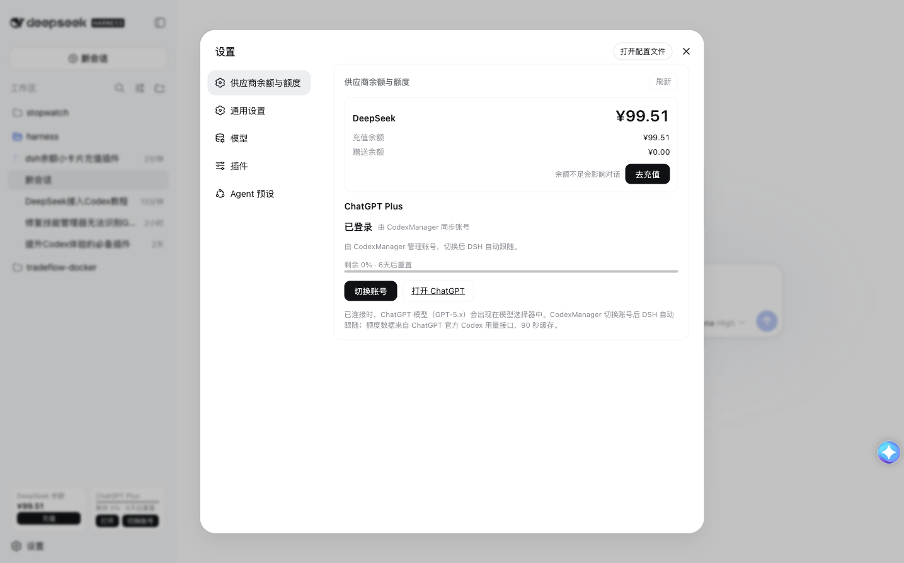
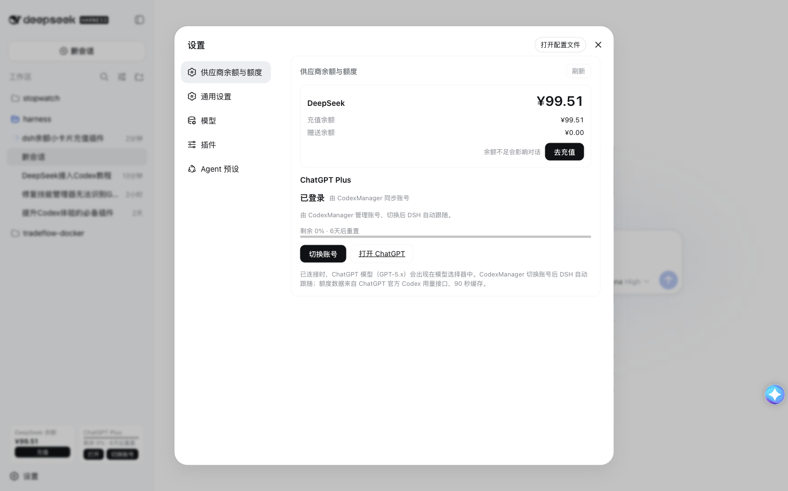

# DSH Provider Balance & Quota

[中文](#中文) · [English](#english)



A DeepSeek Harness plugin suite that brings **DeepSeek balance**, **ChatGPT/Codex quota**, OAuth login, and CodexManager account synchronization into one polished sidebar and settings experience.

## 中文

### 功能

- 侧边栏展示 DeepSeek 余额与 ChatGPT 剩余额度
- ChatGPT OAuth 授权登录，直接作为 DSH 模型使用
- ChatGPT 额度来自官方 Codex 用量接口，显示剩余比例与重置时间
- 自动同步 `~/.codex/auth.json`，跟随 CodexManager 切换账号
- 设置页合并为「供应商余额与额度」
- 一键 DeepSeek 充值、打开 ChatGPT、切换 ChatGPT 账号
- 侧边栏和设置页都提供官方网页授权切换入口
- 兼容浅色/深色主题，使用 DSH 语义化颜色变量

### 界面预览

#### 侧边栏


#### 设置页



### 目录

| 目录 | 说明 |
| --- | --- |
| `dsh-balance-card` | DeepSeek 余额 Host 路由与兼容客户端 |
| `dsh-chatgpt-login` | ChatGPT OAuth、CodexManager 同步、额度接口与统一 UI |
| `docs/images` | 项目截图 |

### 一条命令安装（推荐）

```bash
curl -fsSL https://raw.githubusercontent.com/CalvinQin/dsh-provider-balance-quota/main/install.sh | bash
```

脚本会自动下载插件、写入 `cordis.patch.yml` 并重启 DeepSeek Harness。执行前建议先查看脚本内容；它只会写入 `~/.dsh/profiles/`，不会上传任何凭据。

### 手动安装

将两个插件复制到 DSH profile：

```bash
cp -R dsh-balance-card ~/.dsh/profiles/node_modules/
cp -R dsh-chatgpt-login ~/.dsh/profiles/node_modules/
```

在 `~/.dsh/profiles/web/cordis.patch.yml` 添加：

```yaml
- insert:
    - id: balance-card
      name: dsh-balance-card
      config:
        rev: 2
- insert:
    - id: chatgpt-login
      name: dsh-chatgpt-login
```

重启 DeepSeek Harness 后刷新页面。

### 插件市场说明

目前 DSH 的公开插件加载方式是 profile + `cordis.patch.yml`，暂未发现可直接提交第三方插件的官方公共插件市场。因此本项目先通过公开 GitHub 仓库和一键安装脚本分发。

### 配置与安全

- DeepSeek API Key 通过 DSH 凭据系统读取，不会进入浏览器 bundle。
- ChatGPT OAuth token 保存在本机 `~/.dsh/chatgpt-oauth.json`，权限为 `0600`。
- CodexManager 的当前 token 来源是 `~/.codex/auth.json`，插件只读取并镜像到 DSH，不会把 token 写入仓库。
- 仓库不包含任何真实 token、API Key、账号邮箱或个人凭据。

### ChatGPT 额度

额度接口返回周期窗口的 `used_percent`。界面转换为剩余比例：

```text
remaining = 100 - used_percent
```

因此进度条越长代表剩余额度越多；重置时间由官方接口返回。

## English

### Features

- Shows DeepSeek balance and remaining ChatGPT quota in the sidebar
- Official ChatGPT OAuth device authorization
- Uses ChatGPT/Codex directly as a model provider in DeepSeek Harness
- Reads the official Codex usage endpoint for remaining percentage and reset time
- Watches `~/.codex/auth.json` and follows CodexManager account switching
- Unified settings section: **Provider Balances & Quotas**
- One-click DeepSeek recharge, ChatGPT access, and account switching
- Official web authorization entry in both the sidebar and settings
- Theme-safe semantic colors for light and dark mode

### Screenshots

#### Sidebar


#### Settings


### One-command installation (recommended)

```bash
curl -fsSL https://raw.githubusercontent.com/CalvinQin/dsh-provider-balance-quota/main/install.sh | bash
```

The installer downloads both plugins, updates `cordis.patch.yml`, and restarts DeepSeek Harness. Review `install.sh` first if preferred; it only writes under `~/.dsh/profiles/` and never uploads credentials.

### Manual installation

```bash
cp -R dsh-balance-card ~/.dsh/profiles/node_modules/
cp -R dsh-chatgpt-login ~/.dsh/profiles/node_modules/
```

Add both plugins to `~/.dsh/profiles/web/cordis.patch.yml`, then restart DeepSeek Harness and refresh the page.

### Marketplace status

The current public DSH loading path is profile-based (`cordis.patch.yml`). No public third-party plugin marketplace submission API was found in the current DSH distribution, so this project is distributed through GitHub and the installer above.

### Security

- DeepSeek credentials stay in the DSH credential system and never enter the browser bundle.
- ChatGPT OAuth tokens are stored locally at `~/.dsh/chatgpt-oauth.json` with mode `0600`.
- CodexManager synchronization reads the local auth file but never commits credentials.
- No real tokens, API keys, account emails, or private user data are included in this repository.

### License

MIT. See [`LICENSE`](LICENSE).
